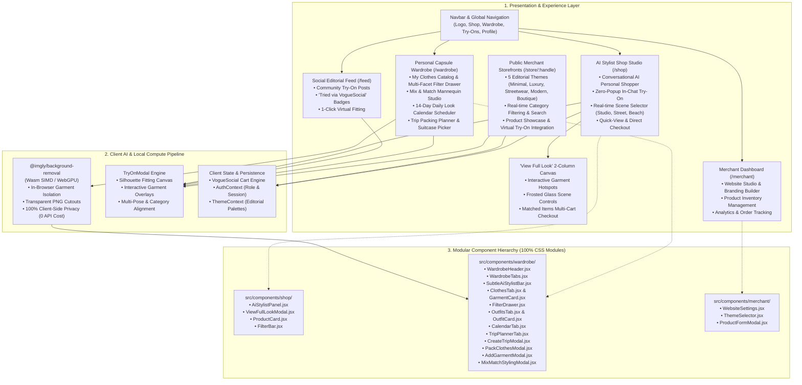

# VogueSocial — Haute Virtual Try-On, AI Stylist & Creator Storefronts

> A luxury social fashion marketplace featuring **In-Chat AI Virtual Try-On**, **In-Browser AI Background Removal**, **Personal Capsule Wardrobe Management**, and **Multi-Theme Merchant Storefronts**.

---

## 🏛️ Client Architecture Diagram

The diagram below illustrates the client-side system architecture, user workflows, in-browser AI processing pipeline, and modular component hierarchy:



---

## ✨ Key Features & Capabilities

### 1. In-Chat AI Stylist & Zero-Popup Virtual Try-On
- **Conversational Assistant**: Chat directly with an intelligent AI personal shopper to receive contextual garment pairings, outfit recommendations, and trend advice.
- **Zero-Popup Inline Fitting**: Clicking **"Try On"** does not disrupt the user with blocking modals; it renders the virtual fitting directly in the chat thread with animated progress and high-definition results.
- **Dynamic Scene Selector**: Switch model backdrops on the fly between **Studio**, **Street**, **Beach**, and **Custom** lighting.
- **2-Column "View Full Look" Experience**: Deep visual exploration canvas featuring glowing interactive hotspots on garments, frosted glass toolbar, and a direct "Shop this Look" sidebar.

### 2. Client-Side In-Browser AI Background Removal
- Powered by **`@imgly/background-removal`** running on WebAssembly & WebGPU.
- **100% Private & Free**: Garment photos taken on floors, hangers, or beds are segmented directly inside the user's browser—images never leave the user's device for cutout processing.
- **Transparent PNG Cutout Output**: Automatically outputs pure transparent PNG base64 assets with a subtle transparency checkerboard preview and 1-click revert capability.

### 3. Personal Capsule Wardrobe Studio
- **My Clothes Catalog**: Digital clothing organizer featuring search, sorting (most worn, least worn, newest), category chips, and a slide-down multi-facet filter drawer (brand, season, occasion, color swatches).
- **Mix & Match Styling Mannequin**: Multi-slot outfit builder to assemble tops, bottoms, outerwear, and shoes into coordinated looks.
- **Daily Look Calendar**: 14-day upcoming outfit scheduler to assign looks to specific dates and log daily wear counts.
- **Trip Packing Planner**:
  - Curated high-resolution destination cover thumbnails (Tokyo, Paris, Milan, New York, London, Bali, Dubai).
  - Dedicated **Suitcase Garment Picker** to pack/unpack wardrobe pieces.
  - Interactive **Travel Essentials Checklist** with custom item creation.

### 4. Multi-Theme Public Merchant Storefronts (`/store/[handle]`)
- Dynamic merchant stores driven by 5 curated architectural template themes:
  - **Minimal**: Crisp editorial serif typography, clean stark borders, gallery aesthetic.
  - **Luxury**: Dark obsidian surfaces, gold accents (`#C9A84C`), Playfair Display typography.
  - **Streetwear**: High-contrast dark mode, bold Barlow Condensed typography, neon lime accent (`#CCFF00`).
  - **Modern**: Plus Jakarta Sans, rounded pills, indigo accents.
  - **Boutique**: Earthy warm tones, Libre Baskerville, soft terracotta accents.
- Responsive product detail pages with color chips, size selectors, stock status, and virtual try-on buttons.

### 5. Code Quality & Standards
- **Strict 100% CSS Modules**: Zero inline styles (`style={...}`) across all components.
- **Pure React JSX**: Fast, lightweight component structure powered by Vite.

---

## 📁 Repository Structure

```
virtual-try-on/
├── public/
│   ├── Shop_images/             # High-res curated editorial apparel catalog
│   └── product_catalog/         # Multi-angle garment assets
├── src/
│   ├── app/
│   │   ├── admin/               # Admin verification & dispute portals
│   │   ├── brand/[handle]/      # Public creator brand hubs
│   │   ├── feed/                # Social lookbook community feed
│   │   ├── merchant/            # Merchant studio, analytics, and website builder
│   │   ├── product/[id]/        # Product detail with 'Tried via VogueSocial'
│   │   ├── profile/             # User account settings
│   │   ├── shop/                # AI Stylist & Zero-Popup Try-On shop
│   │   ├── store/[handle]/      # Multi-theme public merchant storefronts
│   │   └── wardrobe/            # Personal wardrobe & trip packing planner
│   ├── components/
│   │   ├── merchant/            # Storefront builder subcomponents
│   │   ├── shop/                # AI Stylist & View Full Look subcomponents
│   │   ├── wardrobe/            # 13 modular wardrobe subcomponents
│   │   ├── Navbar.jsx           # Global sticky editorial navigation
│   │   └── TryOnModal.jsx       # Interactive virtual fitting canvas
│   ├── context/
│   │   └── AuthContext.jsx      # Client session & authentication context
│   └── lib/
│       ├── data.js              # Social feed & product catalog data
│       ├── shopData.js          # AI stylist match matrix & product catalog
│       └── wardrobeConstants.js # Color swatches, destination presets, categories
├── package.json
└── vite.config.js
```

---

## 🛠️ Getting Started

### Prerequisites
- **Node.js**: v18+ (tested on Node v20/v24)
- **npm** or **yarn**

### Installation
```bash
# Clone the repository
git clone https://github.com/Kirandev242144/VogueSocial.git

# Navigate into project directory
cd VogueSocial

# Install dependencies
npm install
```

### Development Server
```bash
npm run dev
```
The application will launch at `http://localhost:3001` (or `http://localhost:3000`).

### Production Build
```bash
npm run build
```
Compiles optimized assets in `dist/` with clean WebAssembly SIMD and WebGPU bundles.

---

## 📄 License
Proprietary & Confidential · VogueSocial Platform 2026
